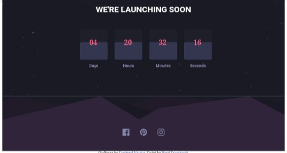

# Launch countdown timer solution

This is a solution to the [Launch countdown timer challenge on Frontend Mentor](https://www.frontendmentor.io/challenges/launch-countdown-timer-N0XkGfyz-). Frontend Mentor challenges help you improve your coding skills by building realistic projects. 

## Table of contents

- [Overview](#overview)
  - [The challenge](#the-challenge)
  - [Screenshot](#screenshot)
  - [Links](#links)
- [My process](#my-process)
  - [Built with](#built-with)
  - [What I learned](#what-i-learned)
- [Author](#author)

## Overview
  A Launch Timer Countdown using HTML, CSS and javascript.

### The challenge

Users should be able to:

- See hover states for all interactive elements on the page
- See a live countdown timer that ticks down every second (start the count at 14 days)
- **Bonus**: When a number changes, make the card flip from the middle

### Screenshot

### Links

- Solution URL: (https://github.com/faozziyyah/launchcountdowntimer)
- Live Site URL: (https://faozziyyah.github.io/launchcountdowntimer/)

## My process

### Built with

- Semantic HTML5 markup
- CSS custom properties
- Flexbox
- Mobile-first workflow
- vanilla javascript

### What I learned

- I learnt how to create a digital clock with JavaScript.
- practical use of the setInterval method.

## Author

- Website - [Daud Faozziyyah Opeyemi] (https://my-portfolio.faozziyyah.vercel.app/)
- Frontend Mentor - [@faozziyyah](https://www.frontendmentor.io/profile/faozziyyah)
- Twitter - [@faozziyyah](https://www.twitter.com/faozziyyah?s=08)
